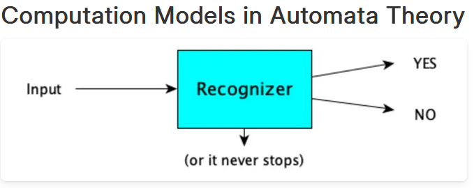
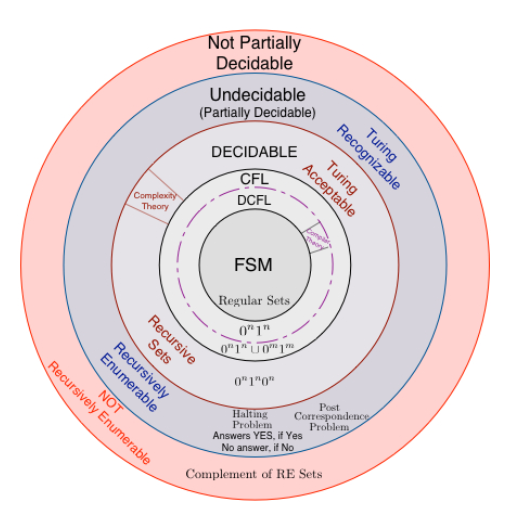

# Introduction to the Theory of Computation

## Overview

The Theory of Computation is a fundamental course in Computer Science that has shaped how the discipline is understood as a science over the past 50 years. This course explores what can be mechanically computed, how quickly it can be done, and the amount of space required for these computations. 

## Key Concepts

- **Binary Strings and Java Code Validation**: The course covers how compilers are designed to accept all valid Java codes and determine the validity of binary sequences. This includes understanding the efficiency and limitations of such systems.

- **Finite Automata and Turing Machines**: It dives into the basics of finite state machines (FSM) and extends to more complex computational models such as Turing machines, illustrating their capabilities and limitations within computational theory.

- **Decidability and Computability**: Important topics also include decidability issues surrounding computational problems, identifying what can and cannot be computed or decided by an algorithm.

## Course Goals

The main goal of this course is to provide students with a deep understanding of the computational theories that underpin modern computer science. This includes exploring various models of computation, understanding their hierarchies, and discussing the practical implications of computational limitations.

# Understanding Computation Models and Decidability

## Diagram Overview

The diagram illustrates the relationship between various computational models and the concept of decidability:

## Description of the Diagram

- **Input Process**: The diagram starts with an input which leads to a computational process. Based on the process, it results in a "Yes" or "No" answer, depicting a decision-making process.

- **FSM (Finite State Machine)**: At the innermost part of the nested circles, indicating that FSMs can solve certain types of problems defined by their state transitions.

- **CFL (Context-Free Language)**: Encompasses FSM capabilities and extends to more complex patterns not solvable by simple FSMs, representing grammar-based computation.

- **Turing Machine**: Surrounding both FSM and CFL, showing that Turing machines can solve problems that both FSMs and CFLs can handle, plus additional problems neither can manage.

- **Undecidable**: The outermost layer indicating problems that are beyond the computational reach of Turing machines, highlighting the limits of computability.

## Conclusion

This representation helps visualize the scope and limitations of different computational models and their relationships concerning language and problem complexity.

