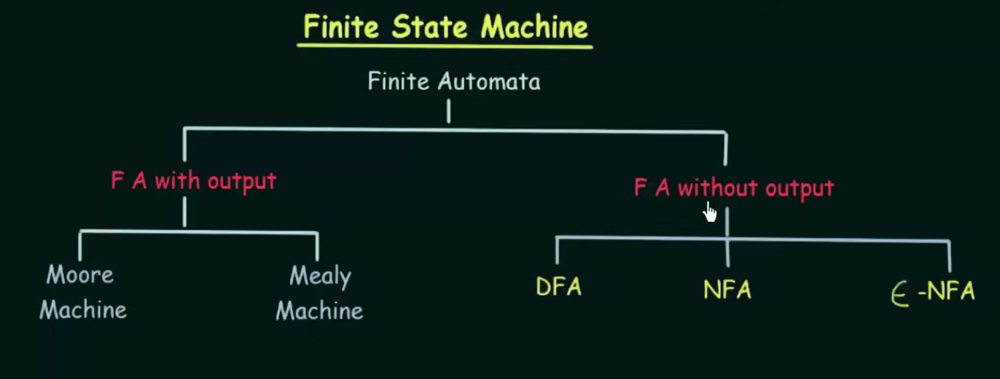
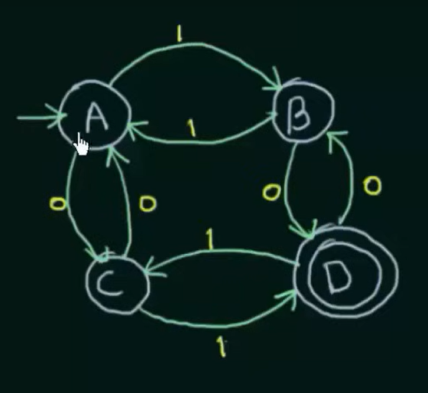

# Finite State Machines (Finite Automata)

Finite State Machines (FSM), or Finite Automata, are foundational computational models used to simulate sequential logic and decision processes. They are categorized based on their behavior and capabilities:

## Types of Finite Automata

### 1. Deterministic Finite Automaton (DFA)
- **Definition**: DFA is an automaton where for each state and symbol, there is exactly one transition.
- **Characteristics**:
  - Only one transition for each symbol from any given state.
  - Easiest to implement among automata.
  - Often used for pattern matching and syntax analysis.

### 2. Nondeterministic Finite Automaton (NFA)
- **Definition**: NFA allows multiple transitions for a single symbol from the same state.
- **Characteristics**:
  - Can include ε-transitions (transitions that do not consume any input symbols).
  - Provides a more flexible way of machine designing.
  - Equivalent in power to DFA, but potentially more compact.

### 3. ε-NFA (NFA with ε-moves)
- **Definition**: A form of NFA where transitions can occur without consuming any input symbols (ε-transitions).
- **Characteristics**:
  - Allows the machine to change states without any input.
  - Useful in constructing regular expressions.

## Finite Automata with Output
Finite automata can also be classified based on whether they produce outputs:

### 1. Moore Machine
- **Output Based on State**: In a Moore machine, the output values are determined by the states.
- **Usage**: Used where the output is required to change synchronously with state changes.

### 2. Mealy Machine
- **Output Based on Transition**: In a Mealy machine, outputs are produced based on transitions and the current inputs.
- **Usage**: More responsive to inputs, as outputs change immediately upon transitions.

## Examples and Diagrams

### DFA and NFA Structure
Here is a conceptual diagram of a DFA and an NFA:

### Transition Table Example
Below is an example of a transition table for a simple FSM:

- **Q (States)**: A set of all possible states in the FSM. Example: \( Q = \{A, B, C, D\} \)
- **Σ (Input Alphabet)**: A set of inputs that the machine accepts. Example: \( \Sigma = \{0, 1\} \)
- **q₀ (Initial State)**: The starting state of the FSM. Example: \( q_0 = A \)
- **F (Final States)**: A set of states where the machine can accept the input string. Example: \( F = \{D\} \)
- **δ (Transition Function)**: A function describing the transitions from one state to another based on the input. This is denoted as \( \delta: Q \times \Sigma \rightarrow Q \).
This diagram illustrates the transitions between states for given inputs. The transitions are marked with the input symbol that causes the move from one state to another.

### Transition Table

Before presenting the transition table, it is useful to understand how the states are connected through specific inputs. Here's a brief overview of transitions as seen in the diagram:

- State A moves to B on input 1, and to C on input 0.
- State B moves to A on input 0, and to D on input 1.
- State C moves to D on input 1, and stays in C on input 0.
- State D moves to C on input 1, and back to A on input 0.

| State | Input: 0 | Input: 1 |
|-------|----------|----------|
| A     | C        | B        |
| B     | A        | D        |
| C     | C        | D        |
| D     | A        | C        |

### Discussion

The transition table complements the diagram by providing a clear tabular view of how the machine reacts to different inputs from any given state. This representation is crucial for analyzing or implementing the FSM in various applications, ranging from simple command parsers to complex network protocols.

## Conclusion

Finite state machines are essential tools in the design and analysis of both software and hardware systems, enabling the modeling of behaviors in a mathematically precise manner. Whether deterministic or nondeterministic, with or without outputs, each type plays a pivotal role in various applications across computer science and engineering disciplines.

